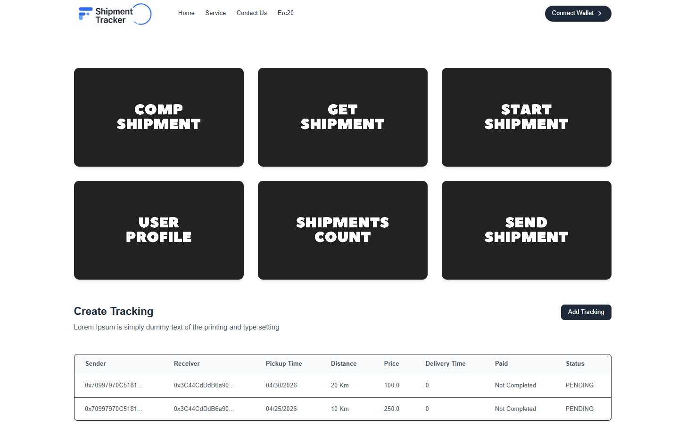

# 📦 Blockchain Shipment Tracking DApp

A decentralized shipment tracking application built using **Next.js, React, Solidity, and Ethers.js**.  
This DApp allows users to create, start, complete, and track shipments securely on the blockchain.

---

## 🚀 Features

- 🔐 MetaMask wallet integration
- 📦 Create shipment
- 🚚 Start shipment
- ✅ Complete shipment
- 🔍 Fetch shipment details by ID
- 📊 View all shipments in a tracking table
- 👤 Profile with shipment count
- 🎨 Responsive UI with Tailwind CSS

---

## 🛠 Tech Stack

**Frontend**
- Next.js
- React.js
- Tailwind CSS
- Context API

**Blockchain**
- Solidity
- Hardhat
- Ethers.js
- MetaMask

---

## ⚙️ Getting Started

### 1️⃣ Clone the repository
```bash
git clone https://github.com/J-Praveenan/shipment-tracking.git
cd shipment-tracking
```

### 2️⃣ Install dependencies
```bash
npm install
```

### 3️⃣ Start Hardhat node
```bash
npx hardhat node
```

### 4️⃣ Deploy contract
```bash
npx hardhat run scripts/deploy.js --network localhost
```
Update contract address and ABI inside Context/Tracking.js.

### 5️⃣ Run the app
```bash
npm run dev
```
Open:
http://localhost:3000


---

## 🦊 MetaMask Setup

1. Install MetaMask browser extension
2. Add Hardhat Localhost Network (if using local blockchain)
3. Import Hardhat test account private key
4. Connect wallet from the app

---


## 🔄 Shipment Workflow

1. Connect wallet  
2. Create shipment  
3. Start shipment  
4. Complete shipment  
5. Track shipment by ID  

---

## 📜 License

MIT License

---

## 🎯 Conclusion

This project demonstrates how blockchain can be used to build a secure and transparent shipment tracking system using smart contracts and modern frontend technologies.

---

## 📸 Application Preview



---


